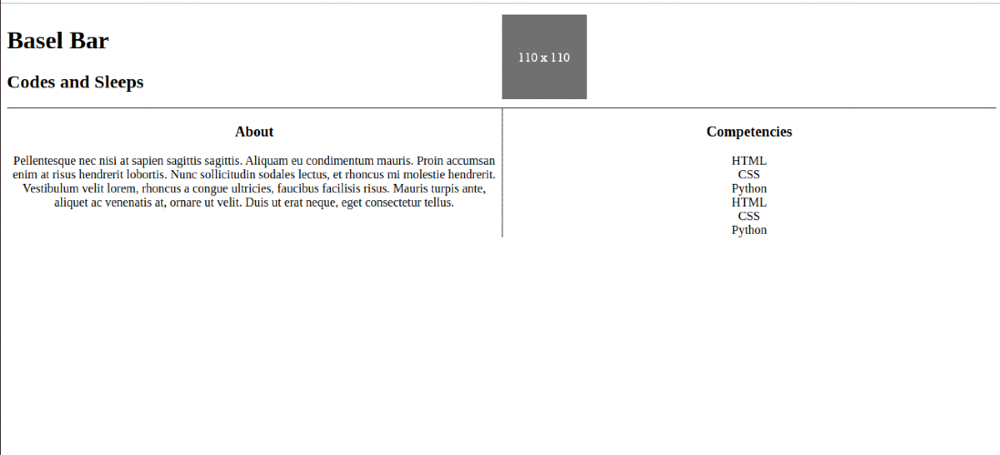
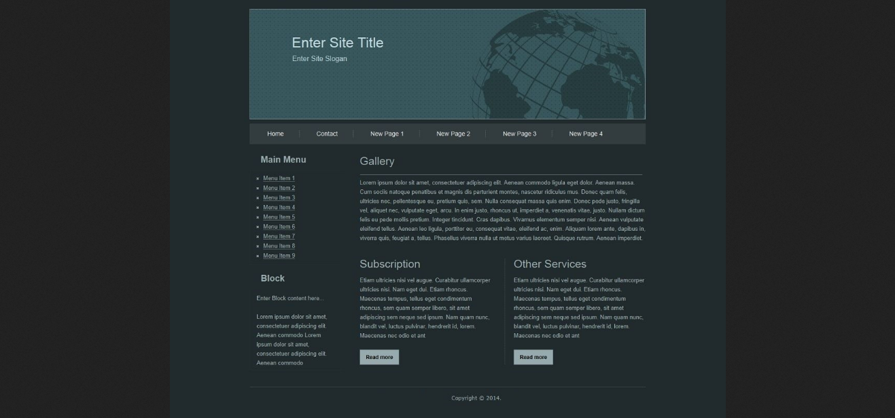

# IT Programming

## HTML/CSS

### level-3 (p)

Welcome back again! here is you will build a real html page with style sheet, are you excited?
Previously you have learned about html structure, elements and how to style them internal and linked to a style sheet page.

#### Hints
- [Google](https://www.google.com)
- [Again](https://www.google.com)

#### Goals
- Creating html page and a style sheet page from scratch.
- Advanced css float, flex, grid.
- Ability to imitate html template.

#### Steps
Creat folder name it to "level-3-yourname" and do inside the following steps 

##### step-1 (25p)

If you remember I'v told you that the cv will use it too much.
let's come back again then!
You will find a folder cv-third-step open it.
You will find index.html name to your name and create a style sheet and make it look like the image below:

If you done now, so you have practice enough to imitate a full page, move to next step!

##### step-2 (50p)

Creat a folder name it to "level-3-yourname" and do inside the following: 
- Create an HTML file and name it “yourname.html"
- Create a style sheet linked in the html page yo uhave been created.
- Build a page that contains all the HTML elements in the image below:

Great! now you've created the first real html page, let's move on to the next step! 

##### step-3 (25p)

You are not able to do this step if you did not finish the previous one before, make sure about that or your points wont be count!
- Fill the page you've created before with information for one of the topics below:
    - Page for a restaurent.
    - Page for a sports wear.
    - Page for a dj producer.
    - Page for a portfolio designer.

You are making a big progress, go and have a good rest, see you next week!
