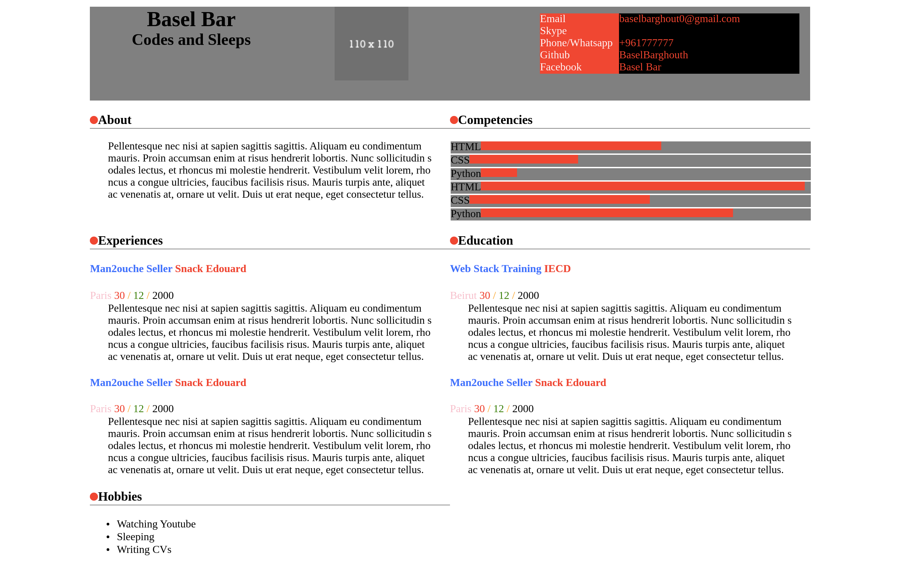

# IT Programming

## HTML/CSS

### level-4 (p)

Are you ready for the big challenge, today we will be done with the cv you remember !

In this level we will test every thing we have learned before, it's just one step

#### Steps
- You have index.html change it to your name and create a style sheet linked to this page.
- You are not allow to change the HTML code.
- Use the style sheet to implement the style in the picture below:

